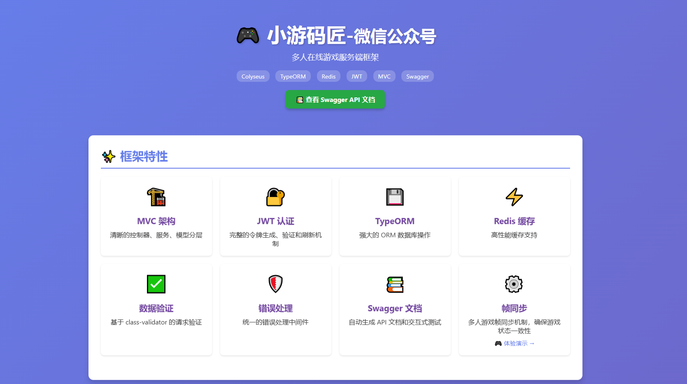
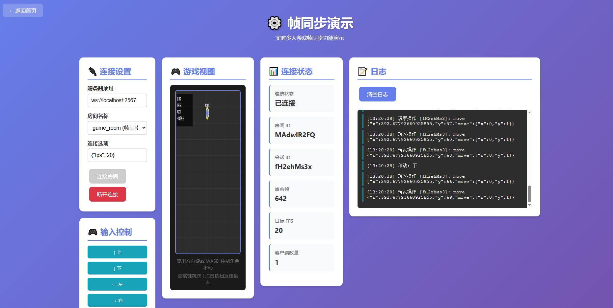

# 🎮 多人在线游戏服务端集成框架-xymj-colyseus-server

【小游码匠】基于 Colyseus 的多人游戏服务器，使用 TypeScript、Express、TypeORM 和 Redis 等构建。

## ✨ 特性

- 🎯 **Colyseus 游戏服务器** - 支持实时多人游戏
- 🚀 **装饰器路由** - 使用 `routing-controllers` 实现 NestJS 风格的 API
- 🔥 **热更新支持** - 开发环境下自动重载，提升开发效率
- 📚 **Swagger API 文档** - 自动生成完整的 API 文档
- 🔐 **JWT 认证** - 完整的用户认证和授权系统
- 💾 **TypeORM** - 强大的 ORM，支持 MySQL/MariaDB
- ⚡ **Redis 缓存** - 高性能缓存支持
- 🎨 **帧同步** - 支持帧同步游戏房间
- 📦 **TypeScript** - 完整的类型支持


#### 同步帧教学演示


## 📋 目录结构

```
src/
├── app.config.ts          # Colyseus 应用配置
├── index.ts               # 应用入口
├── config/                # 配置文件
│   ├── index.ts          # 主配置
│   ├── swagger.ts        # Swagger 配置
│   └── swagger-schemas.ts # Swagger Schema 定义
├── controllers/           # 控制器（自动加载）
│   ├── autoLoad/         # 自动生成的控制器索引
│   │   └── index.ts      # ⚠️ 自动生成，请勿手动修改
│   ├── AuthController.ts  # 认证控制器
│   ├── HealthController.ts # 健康检查控制器
│   └── ...
├── services/              # 业务逻辑层
│   ├── BaseService.ts    # 基础服务类
│   └── AuthService.ts    # 认证服务
├── models/                # 数据模型
│   ├── BaseEntity.ts     # 基础实体类
│   └── User.ts           # 用户模型
├── dto/                   # 数据传输对象
│   └── AuthDto.ts        # 认证 DTO
├── middleware/            # 中间件
│   ├── auth.middleware.ts      # 认证中间件
│   ├── decorator.middleware.ts # 装饰器中间件
│   ├── error.middleware.ts      # 错误处理
│   └── validation.middleware.ts # 验证中间件
├── rooms/                 # Colyseus 房间
│   ├── MyRoom.ts         # 示例房间
│   ├── GameRoom.ts       # 帧同步游戏房间
│   └── schema/           # 房间状态 Schema
├── database/              # 数据库配置
│   └── connection.ts     # 数据库连接
├── utils/                 # 工具函数
│   ├── jwt.ts            # JWT 工具
│   ├── redis.ts          # Redis 客户端
│   ├── response.util.ts  # 响应工具
│   └── ...
├── routes/                # 路由配置
│   └── index.ts          # 路由前缀配置
└── public/                # 静态文件
    ├── index.html
    └── FrameSync.html
```

## 🚀 快速开始

### 环境要求

- Node.js >= 20.9.0
- MySQL/MariaDB
- Redis (可选)

### 安装依赖

```bash
npm install
```

### 配置环境变量

创建 `.env.development` 文件（开发环境）或 `.env.production` 文件（生产环境）：

```env
# 应用配置
NODE_ENV=development
PORT=2567

# 数据库配置
DB_TYPE=mysql
DB_HOST=localhost
DB_PORT=3306
DB_USERNAME=root
DB_PASSWORD=your_password
DB_DATABASE=your_database
DB_SYNC=true
DB_LOGGING=true

# Redis 配置
REDIS_HOST=localhost
REDIS_PORT=6379
REDIS_PASSWORD=
REDIS_DB=0
REDIS_KEY_PREFIX=app:

# JWT 配置
JWT_SECRET=your_jwt_secret_key
JWT_EXPIRES_IN=1h
JWT_REFRESH_SECRET=your_refresh_secret_key
JWT_REFRESH_EXPIRES_IN=7d

# Swagger 配置
SWAGGER_ENABLED=true
SWAGGER_PATH=/api-docs
```

### 运行开发服务器

```bash
npm run dev
```

开发服务器会自动：
- 监听 `src/controllers` 目录，自动更新控制器索引
- 监听所有文件变化，自动重启服务器
- 忽略 `src/public` 目录的变化

### 构建生产版本

```bash
npm run build
```

### 运行生产版本

```bash
node build/index.js
```

## 📖 API 文档

启动服务器后，访问 Swagger API 文档：

```
http://localhost:2567/api-docs
```

## 🎯 使用指南

### 创建新控制器

1. 在 `src/controllers` 目录下创建 `*Controller.ts` 文件
2. 使用装饰器定义路由：

```typescript
import { JsonController, Get, Post, Body, UseBefore } from 'routing-controllers';
import { OpenAPI } from 'routing-controllers-openapi';
import { Response } from 'express';
import { AuthMiddleware } from '../middleware/decorator.middleware';
import { ResponseUtil } from '../utils/response.util';

@JsonController('/example')
@OpenAPI({ tags: ['示例'] })
export class ExampleController {
  @Get('/hello')
  @OpenAPI({
    summary: 'Hello World',
    description: '示例接口',
  })
  hello(@Res() res: Response): Response {
    return ResponseUtil.success(res, { message: 'Hello World' });
  }

  @Post('/protected')
  @UseBefore(AuthMiddleware)
  @OpenAPI({
    summary: '受保护的接口',
    description: '需要认证',
  })
  protected(@Res() res: Response): Response {
    return ResponseUtil.success(res, { message: 'Protected' });
  }
}
```

3. 保存文件后，控制器会自动被加载和注册

### 创建新服务

在 `src/services` 目录下创建服务类：

```typescript
import { BaseService } from './BaseService';
import { User } from '../models/User';
import { getConnection } from '../database/connection';

export class UserService extends BaseService<User> {
  protected repository = getConnection().getRepository(User);

  async findByEmail(email: string): Promise<User | null> {
    return this.repository.findOne({ where: { email } });
  }
}
```

### 创建新模型

在 `src/models` 目录下创建实体类：

```typescript
import { Entity, Column } from 'typeorm';
import { BaseEntity } from './BaseEntity';

@Entity('users')
export class User extends BaseEntity {
  @Column({ unique: true })
  email!: string;

  @Column()
  password!: string;

  @Column({ nullable: true })
  name?: string;
}
```

### 创建新房间

在 `src/rooms` 目录下创建房间类：

```typescript
import { Room, Client } from 'colyseus';
import { MyRoomState } from './schema/MyRoomState';

export class MyRoom extends Room<MyRoomState> {
  onCreate(options: any) {
    this.setState(new MyRoomState());
    // 房间初始化逻辑
  }

  onJoin(client: Client, options: any) {
    // 玩家加入逻辑
  }

  onLeave(client: Client, consented: boolean) {
    // 玩家离开逻辑
  }

  onDispose() {
    // 房间销毁逻辑
  }
}
```

## 🔧 配置说明

### 路由配置

路由前缀在 `src/routes/index.ts` 中配置：

```typescript
export const API_ROUTE_PREFIX = '/api';
```

所有 API 路由都会自动添加此前缀，例如：
- 控制器路径：`/auth/login`
- 实际访问路径：`/api/auth/login`

### 数据库配置

数据库配置在 `src/config/index.ts` 中，支持：
- MySQL/MariaDB
- 自动同步（开发环境）
- 查询日志

### Redis 配置

Redis 配置支持：
- 连接池
- 自动重连
- Key 前缀
- 连接超时

## 📝 可用脚本

```bash
# 开发模式（自动监听和热更新）
npm run dev

# 监听控制器目录变化（自动更新控制器索引）
npm run watch-controllers

# 生成控制器索引（一次性）
npm run generate-controllers

# 构建生产版本
npm run build

# 清理构建文件
npm run clean

# 运行测试
npm run test

# 负载测试
npm run loadtest
```

## 🛠️ 技术栈

- **框架**: Colyseus 0.16.0
- **运行时**: Node.js 20+
- **语言**: TypeScript 5.0+
- **Web 框架**: Express 4.18+
- **路由**: routing-controllers 0.11+
- **ORM**: TypeORM 0.3+
- **数据库**: MySQL/MariaDB
- **缓存**: Redis (ioredis)
- **认证**: JWT (jsonwebtoken)
- **验证**: class-validator + class-transformer
- **文档**: Swagger/OpenAPI

## 📚 核心功能

### 自动控制器加载

系统会自动扫描 `src/controllers` 目录下的所有 `*Controller.ts` 文件，并自动生成索引文件。你只需要：

1. 创建控制器文件
2. 保存文件
3. 系统自动加载和注册

### 热更新

开发环境下，所有文件变化都会自动触发服务器重启：
- 控制器文件变化
- 服务文件变化
- 模型文件变化
- 配置文件变化

### 统一响应格式

所有 API 响应使用统一格式：

```typescript
{
  "success": true,
  "message": "操作成功",
  "data": { ... }
}
```

### 错误处理

统一的错误处理中间件，自动捕获和格式化错误响应。

### JWT 认证

完整的 JWT 认证系统：
- Access Token（短期有效）
- Refresh Token（长期有效）
- 自动刷新机制

## 🔒 安全建议

1. **生产环境配置**：
   - 设置强密码的 JWT Secret
   - 禁用数据库自动同步
   - 配置 Redis 密码
   - 使用 HTTPS

2. **环境变量**：
   - 不要将 `.env` 文件提交到版本控制
   - 使用环境变量管理敏感信息

3. **认证**：
   - 所有需要认证的接口使用 `@UseBefore(AuthMiddleware)`
   - 定期更新 JWT Secret

## 🐛 故障排除

### 控制器未加载

1. 检查文件命名是否符合 `*Controller.ts` 格式
2. 检查控制器类是否导出
3. 查看控制台是否有错误信息

### 热更新不工作

1. 确保使用 `npm run dev` 启动
2. 检查文件是否在 `src` 目录下（`public` 目录被忽略）
3. 确保使用静态导入（`import`），而不是动态导入（`require`）

### 数据库连接失败

1. 检查数据库服务是否运行
2. 验证 `.env` 文件中的数据库配置
3. 检查数据库用户权限

### Redis 连接失败

1. 检查 Redis 服务是否运行
2. 验证 Redis 配置
3. Redis 连接失败不会阻止服务器启动（仅记录错误）

## 📄 许可证

UNLICENSED

## 🤝 贡献

欢迎提交 Issue 和 Pull Request！

## 📞 联系方式

如有问题，请提交 Issue 或联系项目维护者。

---

**微信公众-小游码匠 - Colyseus Server** 🎮

