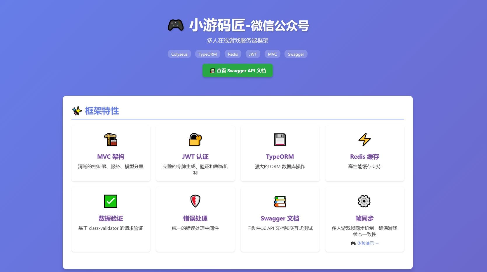
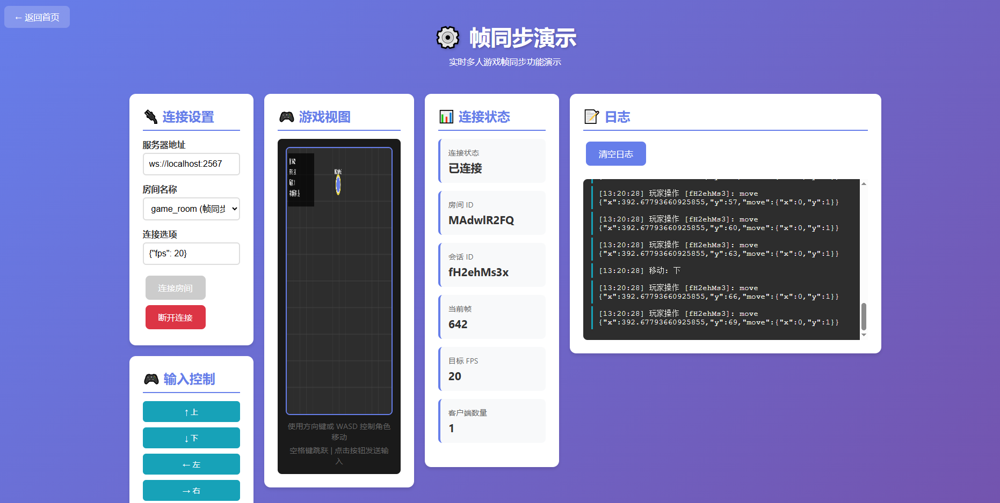

# 🎮 多人在线游戏服务端集成框架-xymj-colyseus-server

【小游码匠】基于 Colyseus 的多人游戏服务器，使用 TypeScript、Express、TypeORM 和 Redis 构建。

## ✨ 特性

- 🎯 **Colyseus 游戏服务器** - 支持实时多人游戏
- 🚀 **装饰器路由** - 使用 `routing-controllers` 实现 NestJS 风格的 API
- 🔄 **自动控制器加载** - 自动扫描并注册所有控制器，无需手动配置
- 🔥 **热更新支持** - 开发环境下自动重载，提升开发效率
- 📚 **Swagger API 文档** - 自动生成完整的 API 文档
- 🔐 **JWT 认证** - 完整的用户认证和授权系统
- 💾 **TypeORM** - 强大的 ORM，支持 MySQL/MariaDB
- ⚡ **Redis 缓存** - 高性能缓存支持
- 🎨 **帧同步** - 支持帧同步游戏房间
- 📱 **微信 / 抖音小游戏** - Access Token（Redis 缓存）与 `code2Session` / `jscode2session` 登录信息接口
- 💬 **频道聊天（Colyseus）** - 世界 / 工会 / 附近 / 队伍房间，世界频道支持 Redis Pub/Sub 跨实例同步
- 📈 **并发压测** - `loadtest_room` 无 JWT 压测页与 Node 脚本，便于观察连接与消息吞吐
- 📦 **TypeScript** - 完整的类型支持



#### 帧同步演示教程



## 📋 目录结构

```
src/
├── app.config.ts          # Colyseus 应用配置
├── index.ts               # 应用入口
├── config/                # 配置文件
│   ├── index.ts          # 主配置
│   ├── minigame.ts       # 微信 / 抖音小游戏 AppID、Secret
│   ├── swagger.ts        # Swagger 配置
│   └── swagger-schemas.ts # Swagger Schema 定义
├── controllers/           # 控制器（自动加载）
│   ├── autoLoad/         # 自动生成的控制器索引
│   │   └── index.ts      # ⚠️ 自动生成，请勿手动修改
│   ├── AuthController.ts  # 认证控制器
│   ├── LoginController.ts # 微信 / 抖音小游戏 access_token 与登录
│   ├── HealthController.ts # 健康检查控制器
│   └── ...
├── services/              # 业务逻辑层
│   ├── BaseService.ts    # 基础服务类
│   └── AuthService.ts    # 认证服务
├── models/                # 数据模型
│   ├── BaseEntity.ts     # 基础实体类
│   └── User.ts           # 用户模型
├── dto/                   # 数据传输对象
│   └── AuthDto.ts        # 认证 DTO
├── middleware/            # 中间件
│   ├── auth.middleware.ts      # 认证中间件
│   ├── decorator.middleware.ts # 装饰器中间件
│   ├── error.middleware.ts      # 错误处理
│   └── validation.middleware.ts # 验证中间件
├── rooms/                 # Colyseus 房间
│   ├── MyRoom.ts         # 示例房间
│   ├── GameRoom.ts       # 帧同步游戏房间
│   ├── LoadTestRoom.ts   # 无 JWT 压测房间（loadtest_room）
│   ├── chat/             # 聊天房间（世界/工会/附近/队伍）
│   └── schema/           # 房间状态 Schema（含 chat/、LoadTestRoomState 等）
├── database/              # 数据库配置
│   └── connection.ts     # 数据库连接
├── utils/                 # 工具函数
│   ├── jwt.ts            # JWT 工具
│   ├── redis.ts          # Redis 客户端
│   ├── response.util.ts  # 响应工具
│   └── ...
├── routes/                # 路由配置
│   └── index.ts          # 路由前缀配置
└── public/                # 静态文件
    ├── index.html
    ├── FrameSync.html     # 帧同步演示
    ├── ChatDemo.html      # 聊天频道演示（JWT + 房间选项）
    └── LoadTestConcurrent.html  # 并发压测（默认 loadtest_room，无需 JWT）
```

项目根目录另有 **`loadtest/`**：`concurrent-join.ts`（Node 并发压测）、`example.ts`（简单示例）。

## 🚀 快速开始

### 环境要求

- Node.js >= 20.9.0
- MySQL/MariaDB
- Redis (可选)

### 安装依赖

```bash
npm install
```

### 配置环境变量

创建 `.env.development` 文件（开发环境）或 `.env.production` 文件（生产环境）：

```env
# 应用配置
NODE_ENV=development
PORT=2567

# 数据库配置
DB_TYPE=mysql
DB_HOST=localhost
DB_PORT=3306
DB_USERNAME=root
DB_PASSWORD=your_password
DB_DATABASE=your_database
DB_SYNC=true
DB_LOGGING=true

# Redis 配置
REDIS_HOST=localhost
REDIS_PORT=6379
REDIS_PASSWORD=
REDIS_DB=0
REDIS_KEY_PREFIX=app:

# JWT 配置
JWT_SECRET=your_jwt_secret_key
JWT_EXPIRES_IN=1h
JWT_REFRESH_SECRET=your_refresh_secret_key
JWT_REFRESH_EXPIRES_IN=7d

# Swagger 配置
SWAGGER_ENABLED=true
SWAGGER_PATH=/api-docs

# 聊天房间单实例最大连接数（世界/工会/附近/队伍）
CHAT_ROOM_MAX_CLIENTS=5000
# 世界聊天跨实例同步（Redis Pub/Sub 频道名）
CHAT_WORLD_REDIS_CHANNEL=colyseus:chat:world

# 压测房 loadtest_room（生产可关闭）
LOADTEST_ROOM_MAX_CLIENTS=10000
LOADTEST_ROOM_ENABLED=true
```

小游戏 **AppID / AppSecret** 在 `src/config/minigame.ts`（`DouYinConfig`、`WeiXinConfig`）中填写。

### 运行开发服务器

```bash
npm run dev
```

开发服务器会自动：
- 监听 `src/controllers` 目录，自动更新控制器索引
- 监听所有文件变化，自动重启服务器
- 忽略 `src/public` 目录的变化

### 构建生产版本

```bash
npm run build
```

### 运行生产版本

```bash
node dist/index.js
```

## 📖 API 文档

启动服务器后，访问 Swagger API 文档：

```
http://localhost:2567/api-docs
```

## 📱 微信与抖音小游戏登录

HTTP API 前缀为 **`/api`**（见 `src/routes/index.ts`）。小游戏相关控制器：`LoginController`，标签 **「小游戏登录相关」**。

| 方法 | 路径 | 说明 |
|------|------|------|
| GET | `/api/minigame/douyin/access_token` | 获取抖音小游戏 **access_token**（带 Redis 缓存） |
| GET | `/api/minigame/douyin/login` | 抖音登录：Query 传 `code`、`anonymous_code`，服务端请求字节 **jscode2session**，返回 openid / session_key 等 |
| GET | `/api/minigame/weixin/access_token` | 获取微信小游戏 **access_token**（带 Redis 缓存） |
| GET | `/api/minigame/weixin/login` | 微信登录：Query 传 **`jsCode`**（`wx.login` 拿到的 code），请求微信 **jscode2session** |

实现细节见 `src/services/AccessTokenAndLoginService.ts`（抖音：`minigame.zijieapi.com`；微信：官方 `sns/jscode2session` 与 `cgi-bin/token`）。  
拿到 openid 等信息后，业务可自行落库并与站内账号绑定；需要进 **带 `@RequireAuth()` 的 Colyseus 房间** 时，客户端仍应使用 **`/api/auth/login`** 等流程获取 **JWT**，在 `joinOrCreate` 的 options 里传 `token` 或 `accessToken`。

## 💬 Colyseus 聊天频道

在 `src/app.config.ts` 中已注册四个聊天房间（名称定义于 `src/rooms/chat/ChatRoomName.ts`）：

| 房间名 | 频道 | 说明 |
|--------|------|------|
| `chat_world_room` | 世界 | 全服广播；多实例部署时通过 **Redis Pub/Sub**（`CHAT_WORLD_REDIS_CHANNEL`）同步消息 |
| `chat_guild_room` | 工会 | 同 `guildId` 成员可见 |
| `chat_nearby_room` | 附近 | 依赖坐标与 `nearbyRadius`，可发 **`updatePosition`** 更新位置 |
| `chat_team_room` | 队伍 | 同 `teamId` 成员可见 |

**认证**：`BaseChatRoom` 的 `onCreate` / `onJoin` 使用 **`@RequireAuth()`**，join 时需传有效 JWT（及业务需要的 `guildId` / `teamId` / 坐标等 options）。

**客户端消息**：

- **`chat`**：负载可为 `{ message: string }`（或兼容字段），服务端写入历史并按频道过滤后 **`chat`** 事件下发。
- **`updatePosition`**：附近频道用，例如 `{ x, y }`。

**演示页**：启动服务后打开 `http://localhost:2567/ChatDemo.html`（首页亦有入口）。

**压测（无需 JWT）**：`loadtest_room` + `LoadTestConcurrent.html` 或 `npm run loadtest:concurrent`（详见页面说明与 `loadtest/concurrent-join.ts`）。

### 工会聊天简单示例

**服务端**（已内置）：工会房为 `GuildChatRoom`，继承 `BaseChatRoom`，只实现「谁能收到消息」：双方都有 `guildId` 且相等时，接收方才会收到 `chat` 推送。

```typescript
// src/rooms/chat/GuildChatRoom.ts（逻辑摘录）
protected isRecipient(sender: ChatPlayer, target: ChatPlayer): boolean {
  if (!sender.guildId || !target.guildId) return false;
  return sender.guildId === target.guildId;
}
```

入参里的 `guildId` 在 `BaseChatRoom.onJoin` 写入 `ChatPlayer`（来自 `joinOrCreate` 的 options）；消息正文走 `onMessage("chat")` → `handleChat` → `distributeChat` 按上式过滤。

**客户端**（Colyseus.js，与 `ChatDemo.html` 一致：`room` 名称为 **`chat_guild_room`**，需有效 **JWT**）：

```typescript
import { Client } from "colyseus.js";

const client = new Client("http://localhost:2567");

const room = await client.joinOrCreate("chat_guild_room", {
  token: accessToken,       // 与 RequireAuth 一致，也可用 accessToken
  guildId: "1001",          // 同一工会的客户端填相同 guildId 才能互聊
});

room.onMessage("chat", (payload) => {
  // payload: channel, guildId, teamId, sender{ sessionId, userId, username }, message, timestamp
  console.log(payload.sender?.username, payload.message);
});

room.send("chat", { message: "工会频道测试" });
```

同一房间实例内，**不同 `guildId` 的玩家互不可见对方消息**；未传或传空 `guildId` 时，`isRecipient` 不会把消息发给任何人（含自己），请务必带入真实工会 ID。

## 🎯 使用指南

### 创建新控制器

1. 在 `src/controllers` 目录下创建 `*Controller.ts` 文件
2. 使用装饰器定义路由：

```typescript
import { JsonController, Get, Post, Body, UseBefore } from 'routing-controllers';
import { OpenAPI } from 'routing-controllers-openapi';
import { Response } from 'express';
import { AuthMiddleware } from '../middleware/decorator.middleware';
import { ResponseUtil } from '../utils/response.util';

@JsonController('/example')
@OpenAPI({ tags: ['示例'] })
export class ExampleController {
  @Get('/hello')
  @OpenAPI({
    summary: 'Hello World',
    description: '示例接口',
  })
  hello(@Res() res: Response): Response {
    return ResponseUtil.success(res, { message: 'Hello World' });
  }

  @Post('/protected')
  @UseBefore(AuthMiddleware)
  @OpenAPI({
    summary: '受保护的接口',
    description: '需要认证',
  })
  protected(@Res() res: Response): Response {
    return ResponseUtil.success(res, { message: 'Protected' });
  }
}
```

3. 保存文件后，控制器会自动被加载和注册

### 创建新服务

在 `src/services` 目录下创建服务类：

```typescript
import { BaseService } from './BaseService';
import { User } from '../models/User';
import { getConnection } from '../database/connection';

export class UserService extends BaseService<User> {
  protected repository = getConnection().getRepository(User);

  async findByEmail(email: string): Promise<User | null> {
    return this.repository.findOne({ where: { email } });
  }
}
```

### 创建新模型

在 `src/models` 目录下创建实体类：

```typescript
import { Entity, Column } from 'typeorm';
import { BaseEntity } from './BaseEntity';

@Entity('users')
export class User extends BaseEntity {
  @Column({ unique: true })
  email!: string;

  @Column()
  password!: string;

  @Column({ nullable: true })
  name?: string;
}
```

### 创建新房间

在 `src/rooms` 目录下创建房间类：

```typescript
import { Room, Client } from '@colyseus/core';
import { MyRoomState } from './schema/MyRoomState';
import { RequireAuth } from '../utils/decorators/RequireAuth';

export class MyRoom extends Room<MyRoomState> {
  maxClients = 4;
  state = new MyRoomState();

  /**
   * 房间创建时的回调
   * 使用 @RequireAuth() 装饰器可以要求创建房间时提供有效的 JWT token
   * 
   * 客户端需要在 options 中传递：
   * - token: JWT access token（必需，或使用 accessToken）
   * - accessToken: JWT access token（必需，与 token 等效）
   * 
   * 验证成功后，装饰器会自动在 options 中添加用户信息：
   * - options.userId: 用户ID（来自 JWT payload）
   * - options.username: 用户名（来自 JWT payload）
   * - options.email: 用户邮箱（来自 JWT payload）
   * - options.tokenPayload: 完整的 JWT payload 对象，包含所有 token 中的信息
   */
  @RequireAuth()
  onCreate(options: any) {
    // 可以使用装饰器自动添加的用户信息
    console.log('房间创建者:', options.userId, options.username);
    console.log('Token Payload:', options.tokenPayload);
    // options.tokenPayload 包含完整的 JWT payload，例如：
    // {
    //   userId: "123",
    //   username: "user123",
    //   email: "user@example.com",
    //   iat: 1234567890,  // 签发时间
    //   exp: 1234571490   // 过期时间
    // }
    
    this.setState(new MyRoomState());
    // 房间初始化逻辑
  }

  /**
   * 玩家加入房间时的回调
   * 使用 @RequireAuth() 装饰器可以要求加入房间时提供有效的 JWT token
   * 
   * 客户端需要在 options 中传递：
   * - token: JWT access token（必需，或使用 accessToken）
   * - accessToken: JWT access token（必需，与 token 等效）
   * 
   * 验证成功后，装饰器会自动在 options 中添加用户信息（同上）
   */
  @RequireAuth()
  onJoin(client: Client, options: any) {
    // 可以使用装饰器自动添加的用户信息
    console.log('玩家加入:', options.userId, options.username);
    console.log('Token Payload:', options.tokenPayload);
    // 玩家加入逻辑
  }

  onLeave(client: Client, consented: boolean) {
    // 玩家离开逻辑
  }

  onDispose() {
    // 房间销毁逻辑
  }
}
```

#### 安全机制说明

**@RequireAuth() 装饰器** 提供了房间级别的 JWT token 验证：

1. **功能**：
   - 验证客户端传递的 JWT token 是否有效
   - 对比 Redis 中存储的 token 是否一致
   - 验证失败时自动拒绝连接并返回"授权失败"错误

2. **使用方式**：
   - 在 `onCreate` 或 `onJoin` 方法上添加 `@RequireAuth()` 装饰器
   - 客户端连接时需要在 `options` 中传递 `token` 或 `accessToken`

3. **客户端连接示例**：
```typescript
// 客户端连接代码
const room = await client.joinOrCreate("my_room", {
  // 必需参数（二选一）：
  token: "your-jwt-access-token",        // 方式1：使用 token
  // 或
  // accessToken: "your-jwt-access-token", // 方式2：使用 accessToken（与 token 等效）
  
  // 可选：其他自定义参数
  fps: 20,
  gameMode: "ranked",
  // ...
});
```

**注意**：`token` 和 `accessToken` 是等效的，装饰器会优先查找 `token`，如果不存在则查找 `accessToken`。

4. **验证流程**：
   - 检查是否提供了 `token` 或 `accessToken`
   - 验证 JWT token 的有效性（签名、过期时间等）
   - 从 Redis 中获取存储的 accessToken 并对比
   - 如果 Redis 中没有 accessToken，则检查是否有 refreshToken（向后兼容）
   - 验证成功后，将用户信息附加到 `options` 中供后续使用：
     - `options.userId` - 用户ID
     - `options.username` - 用户名
     - `options.email` - 用户邮箱
     - `options.tokenPayload` - 完整的 JWT payload 对象（包含所有 token 中的信息，如签发时间、过期时间等）

5. **options.tokenPayload 说明**：
   `tokenPayload` 是 JWT token 解码后的完整 payload 对象，包含：
   ```typescript
   {
     userId: string | number,    // 用户ID
     username?: string,          // 用户名（如果 token 中包含）
     email?: string,             // 用户邮箱（如果 token 中包含）
     iat: number,               // 签发时间（Unix 时间戳）
     exp: number,               // 过期时间（Unix 时间戳）
     // ... 其他自定义字段
   }
   ```
   你可以在 `onCreate` 或 `onJoin` 方法中通过 `options.tokenPayload` 访问这些信息。

6. **错误处理**：
   - 如果验证失败，会抛出 `AuthenticationError`
   - Colyseus 会自动拒绝连接并返回错误信息给客户端

## 🔧 配置说明

### 路由配置

路由前缀在 `src/routes/index.ts` 中配置：

```typescript
export const API_ROUTE_PREFIX = '/api';
```

所有 API 路由都会自动添加此前缀，例如：
- 控制器路径：`/auth/login`
- 实际访问路径：`/api/auth/login`

### 数据库配置

数据库配置在 `src/config/index.ts` 中，支持：
- MySQL/MariaDB
- 自动同步（开发环境）
- 查询日志

### Redis 配置

Redis 配置支持：
- 连接池
- 自动重连
- Key 前缀
- 连接超时

## 📝 可用脚本

```bash
# 开发模式（自动监听和热更新）
npm run dev

# 构建生产版本
npm run build

# Colyseus 并发压测（默认房间 loadtest_room，无需 token；大并发请用本脚本而非浏览器单页）
npm run loadtest:concurrent -- --num 1000 --delay 10 --sendInterval 100
```

## 🛠️ 技术栈

- **框架**: Colyseus 0.16.0
- **运行时**: Node.js 20+
- **语言**: TypeScript 5.0+
- **Web 框架**: Express 4.18+
- **路由**: routing-controllers 0.11+
- **ORM**: TypeORM 0.3+
- **数据库**: MySQL/MariaDB
- **缓存**: Redis (ioredis)
- **认证**: JWT (jsonwebtoken)
- **验证**: class-validator + class-transformer
- **文档**: Swagger/OpenAPI

## 📚 核心功能

### 自动控制器加载

系统会自动扫描 `src/controllers` 目录下的所有 `*Controller.ts` 文件，并自动生成索引文件。你只需要：

1. 创建控制器文件
2. 保存文件
3. 系统自动加载和注册

### 热更新

开发环境下，所有文件变化都会自动触发服务器重启：
- 控制器文件变化
- 服务文件变化
- 模型文件变化
- 配置文件变化

### 统一响应格式

所有 API 响应使用统一格式：

```typescript
{
  "success": true,
  "message": "操作成功",
  "data": { ... }
}
```

### 错误处理

统一的错误处理中间件，自动捕获和格式化错误响应。

### JWT 认证

完整的 JWT 认证系统：
- Access Token（短期有效）
- Refresh Token（长期有效）
- 自动刷新机制

## 🔒 安全建议

1. **生产环境配置**：
   - 设置强密码的 JWT Secret
   - 禁用数据库自动同步
   - 配置 Redis 密码
   - 使用 HTTPS

2. **环境变量**：
   - 不要将 `.env` 文件提交到版本控制
   - 使用环境变量管理敏感信息

3. **认证**：
   - 所有需要认证的接口使用 `@UseBefore(AuthMiddleware)`
   - 定期更新 JWT Secret

## 🐛 故障排除

### 控制器未加载

1. 检查文件命名是否符合 `*Controller.ts` 格式
2. 检查控制器类是否导出
3. 查看控制台是否有错误信息

### 热更新不工作

1. 确保使用 `npm run dev` 启动
2. 检查文件是否在 `src` 目录下（`public` 目录被忽略）
3. 确保使用静态导入（`import`），而不是动态导入（`require`）

### 数据库连接失败

1. 检查数据库服务是否运行
2. 验证 `.env` 文件中的数据库配置
3. 检查数据库用户权限

### Redis 连接失败

1. 检查 Redis 服务是否运行
2. 验证 Redis 配置
3. Redis 连接失败不会阻止服务器启动（仅记录错误）

## 📄 许可证

UNLICENSED

## 🤝 贡献

欢迎提交 Issue 和 Pull Request！

## 📞 联系方式

如有问题，请提交 Issue 或联系项目维护者。 & 公众号进群研讨

---

**小游码匠 - Xymj-Colyseus Server** 🎮

